# KDD Assignment Report 
#### Richard Chapman 
MAPi PhD November 2024

## **Overview**
   A report detailing the approach, results and potential improvements in applying machine learning and data science techniques to a shopping sales prediction problem. The results indicate that a Random Forest model with appropiate data cleaning and engineering performed most accurately on the test set data.

## **Introduction**
The assignment is defined as "From the products close to expiration, which ones will be sold before the expire data?" [^fn1] 
The evaluation criteria are stated as follows :- Submissions are evaluated on Accuracy between the predicted value and the observed target. 

## **Methodology**

The author used a mixture of Jupyter Notebooks and Python [^fn2] native development utilising a Windows 11 laptop with 16Gb of memory and an NVidia Geforce RTX GPU. 
 
A standard Python based ML workflow and pipeline [^fn3] was used as a framework. The data clean up, feature engineering, model building and analysis were performed in a iterative manner with only the main results contained within this report.

Evaluation and reporting were performed using various statistical methods including the Area under the ROC curve as it provides a better quality single value metric than accuracy [^fn4].

## Data Analysis

### Initial Exploratory Data Analysis

#### Data clean up

The data is provided as a set of comma seperated files split into test and training sets. The data are composed of categorical and numerical entries in a standard table format. An intial evaluation of the data shows that :-

- Numerical data contain commas and full stops in the european style.
- The brand data column contained differing formats for some of the same branding elements (e.g. "Marca 2", "marca 2").
- The data contains date entries in two differing formats.
- The ID columns was used as an index for the tabular data and not as a feature entry.
- The y training data contained similar numbers of both classes (0 and 1) and was therfore balanced.
- The weight column is stored as an object string but can be converted to a numerical value.
- The new_pvp (discount) column actually contained 2 values for new_pvp () and discount respectively.
- Once new_pvp and discount were seperated it was observed that the discount had been calculated incorrectly.
- The data contained null values.
- The store id is treated as a numerical value but in reality should be categorical (encoded) as the model will assume that a numerical value can be used in a statistically significant manner.
- Similarly the sku data should be categorically encoded for the same reasoning.
  
   

##### Tabular Data View
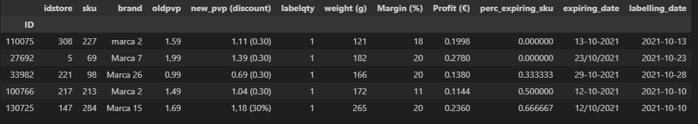

##### Initial Data types
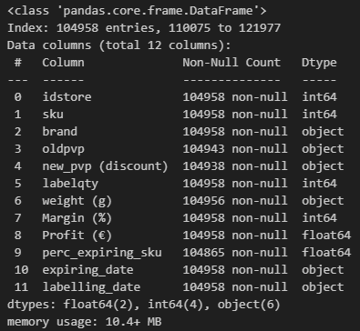

Initial data exploration indicated null values in several of the column data.

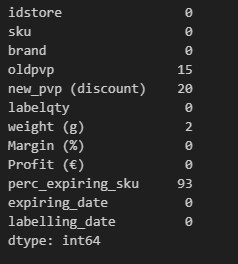

There are many unique values for the categorical data (especially the brand column)

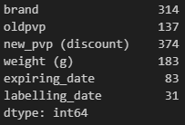

### Statistical Analysis
 
After applying some simple statistical analysis to the numerical values we can see that :-

 - The 'labelqty' value is only ever 1.0 and is therefore removed from the preprocessed data.
 - The numerical values require scaling prior to fitting any models.  
 - Some of the data distributions are skewed (e.g. profit) and may require transforming to provide the learning models a more 'normal' distribution.
 - There may be some new features that can be derived form the quantitative and qualitative data.

### Initial statistics

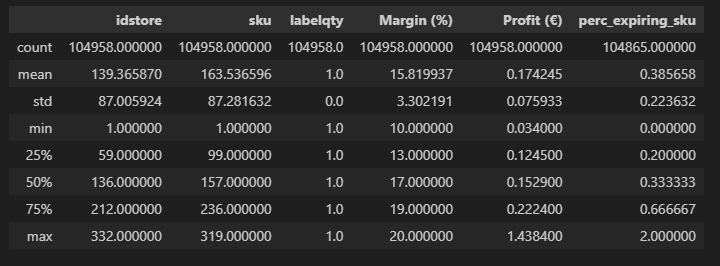

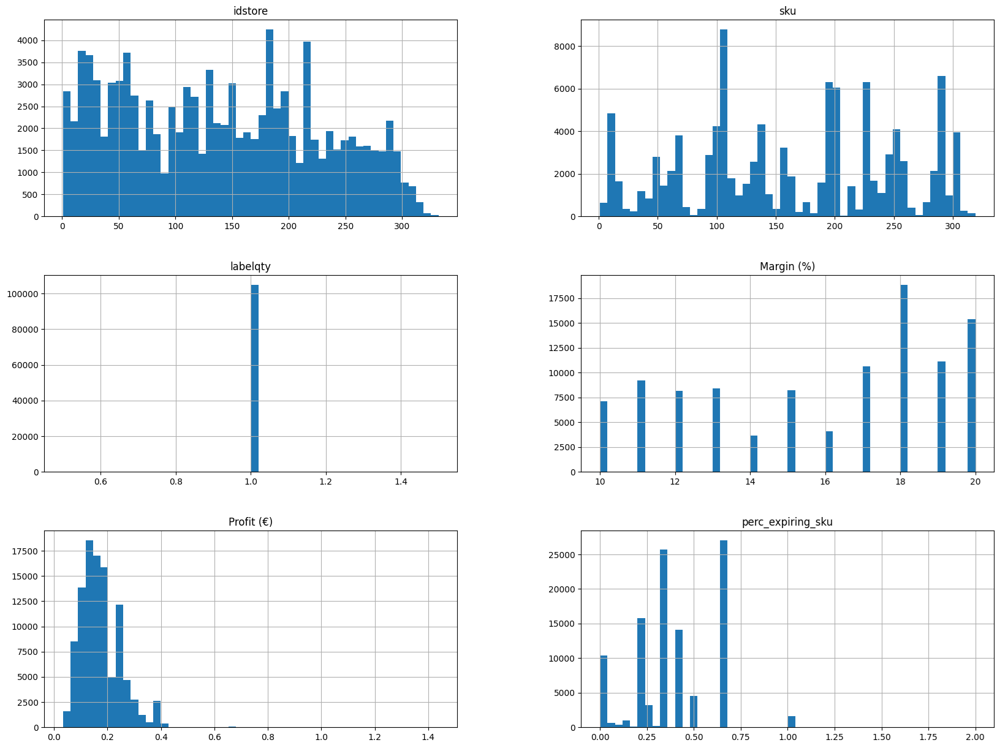

#### Initial Correlation Matrix
[pandas corr](https://pandas.pydata.org/docs/reference/api/pandas.DataFrame.corr.html).
[pearson corr](https://en.wikipedia.org/wiki/Pearson_correlation_coefficient)

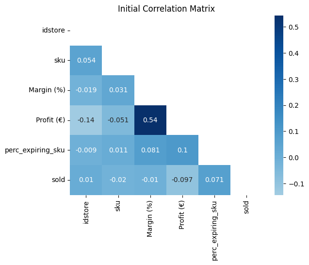 

From the correlation matrix above it can be seen that Profit and Margin are correlated and the model **may** be improved by integrating them. 

### Feature improvement

From the above analysis it can be seen that for the pre processing pipeline we will need to scale the numerical values as otherwise greater significance may be attributed to larger range data.
There are missing values and therefore we need to perform imputation on some of the data.

 and transform the numerical data and in addition convert the categorical data into numerical for input to the training pipeline. Before submitting the data to the pipeline we can perform some feature engineering and derive some duration and day of the week data from the dates given (after suitable reformatting). The transformation of the numerical data was carried out using the yeo-johnson method found in [^fn4]

- The weight column is now converted to numerical values.
- The discount column is correctly calculated from oldpvp and new_pvp.
- The date columns have been re-formatted and derived features expring_day, labelling_day and duration_days added. The expiring and labelling days are encoded as categorical values.
- A new column Cost derived from margin and profit is added and margin dropped as it was highly correlated with profit anyway.

#### After imputation, scaling and further categorical processing

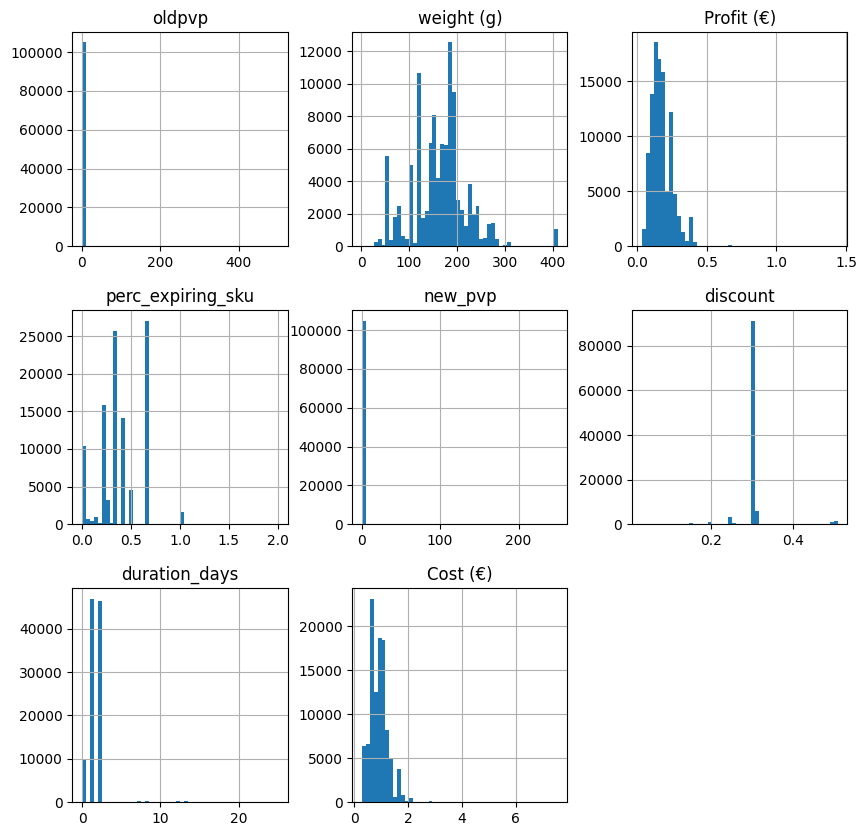

#### Correlation Matrix 

After further processing it can be seen that profit and margin are still moderatley correlated but now so are discount and duration in days between labelling (which in retrospection is to be expected).
 
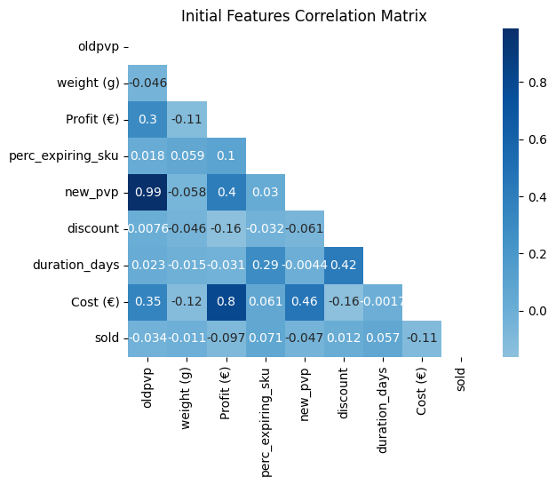

From the correlation matrix above we can see that the profit and Cost vales are highly correlated and so we drop the new Cost feature. In addition it can be seen that new pvp and oldpvp are also highly correlated and they are also dropped as we have profit and discount coverage.

#### Feature Importance 

Using a Random Forest estimator with default initial weights and the processing pipeline we get the following graph of the top 10 most important features. 
 
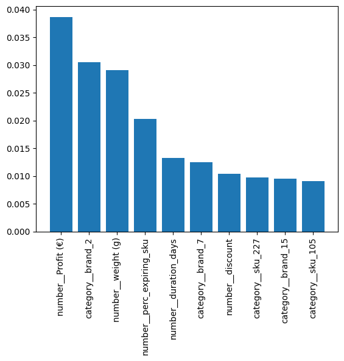

From this we can see the importance of the derived features (number_duration_days) for instance.

### Baseline model Performance 

Using only the most basic of feature processing and no feature engineering a linear regularized model with stochastic gradient descent [SGDClassifier](https://scikit-learn.org/1.5/modules/generated/sklearn.linear_model.SGDClassifier.html) gave an base accuracy score of **63%**.

Using this initial feature processing, engineering and improvement  performance was utilised as a first cut baseline (using the default parametersand a stopping criterion of 10000 iterations). The baseline accuracy was determined to be **64%**. Thus the defined pre-processing pipeline provided an improvement. 

 

## Experimental Design

### Model Selection

Choosing the correct estimator for a particular data analysis is a non-trivial exercise in of itself [^fn5]. The approach taken was to iterate through a few representative machine learning models to get a coarse grain view of the performance with default (arguably sensible) parameters. 

In order to facilitate this a small model generation, timing and results reporting tool was developed. The models chosen by the author were 
- SGD (SGDClassifier) 
- Decision Tree (DecisionTreeClassifier)
- Random Forest (RandomForestClassifier)
- xgboost (XGBClassifier)
- k neighbours (KNeighborsClassifier)
- ANN
NOTE All are classes from the scikit-learn libraries [^fn6] except the ANN which was a TensorFlow keras based model [^fn7].

The intention was to analyse all of the models performance based on ROC graphs [^fn8] [^fn9], AuC and accuracy results. The data were split using k-fold cross validation in order to reduce the risk of overfitting. The results were generated from the framework for later analysis and model selection. 

##### Model selection results
An example of the output from the framework (linear classifier in this case)  can be seen below. (The full results are too long and detailed to include but may be viewed at [^fn10] )
### Training sgd Train - Test Split Score:0.6620797604464407
              precision    recall  f1-score   support

         0.0       0.65      0.58      0.61     33972
         1.0       0.67      0.74      0.70     39498

    accuracy                           0.66     73470
   macro avg       0.66      0.66      0.66     73470
weighted avg       0.66      0.66      0.66     73470
### Test sgd Train - Test Split Score:0.6665713922764228
              precision    recall  f1-score   support

         0.0       0.66      0.58      0.62     14586
         1.0       0.67      0.74      0.70     16902

    accuracy                           0.67     31488
    macro avg       0.67      0.66     0.66     31488
    weighted avg    0.67      0.67     0.66     31488
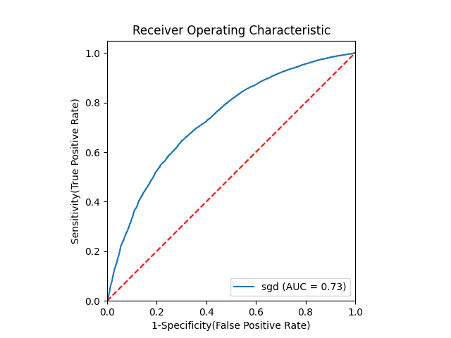
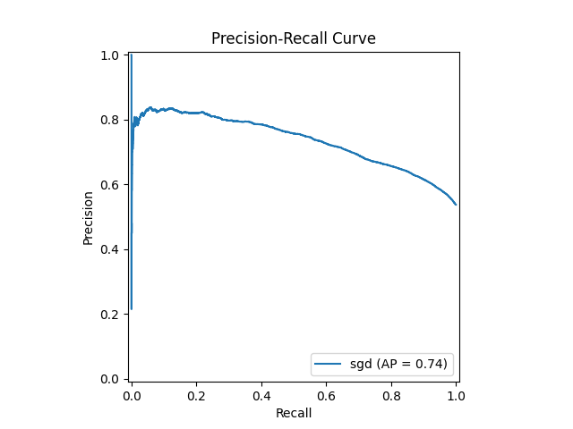
| Model | Accuracy | AuC |   f1   |
|---:|---------:|-------------:|-------------:|
| SGD |  0.67 | 0.68 | 0.66 |
| Tree | 0.71 | 0.72 | 0.71 |
| Forest | 0.72 | 0.79 | 0.72 |
| XG Boost | 0.69 | 0.76 | 0.69 |
| KNN | 0.69 | 0.72 | 0.69 |
| ANN | 0.70 | * | * |

From the results of the iterative testing the Random Forest model was chosen as it had the highest accuracy and AuC scores. 

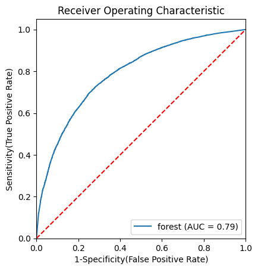
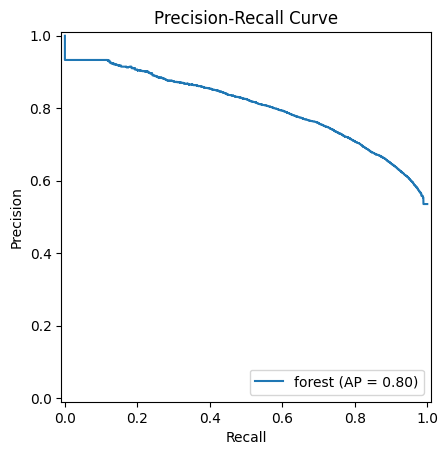

### Hyperparameter Tuning

In order to attempt to improve further on the scores achieved by the winning model, hyperparameter tuning was undertaken using the scikti-learn libraries. Hyperparameter tuning can take a significant amount of time thus only the winning model (Random Forest) and the ANN deep learning model were subject to Hyperparameter tuning (purely a curiosity driven decison on the authors part).

Hyperparameter tuning is the process whereby a model may be refined by altering it's internal parameters until an optimal solution is found. [^fn11] Effectively, it is a search based optimisation technique. There are many versions, including brute force (grid), random search, Bayesian and genetic approaches amongst others.  

Initially a grid search was utilised, which proved to be a mistake as 36 hours later no results had been achieved. The random search approach to hyperparameters tuning was adopted and again several iterations of this process were performed. The parameters were stored and the promising models re-instantiated and submitted to Kaggle. The risk here, of course, is that the optimal parameters will never be found because even for random search some initial conditions and ranges have to be specified.

### Kaggle Performance 

Initially a reasonably high score was attained (72%) but it was realised that the ID parameter had been used inadvertently in the first submission. The rest of the intervening time was spent data cleaning, feature improvement. It cab be seen from the results that a baseline score with the raw data (still with some imputation and scaling but no feature engineering) produced an accuracy of 63%.

On one memorable occasion an overfiited version of the Random Forest achieved a local test accuracy of 84%. Upon submission to Kaggle and the subsequent blow to morale score of 63%. K Fold cross validation was used to reduce the risk of overfitting.

The overall improvement from the Baseline was close to 10% with the last submission of the Random Forest model, with data engineered pipeline and hyperparameters tuned, gave an accuracy score of 0.72 (rounding up). The ANN model utilised Hyperband tuning gave a prediction accuracy of 70% but much less time overall was spent on this particular model.

### Conclusion

**Mark Twain** - *"It takes a thousand men to invent a telegraph, or a steam engine, or a phonograph, or a photograph, or a telephone or any other important thing—and the last man gets the credit and we forget the others. He added his little mite—that is all he did. These object lessons should teach us that ninety-nine parts of all things that proceed from the intellect are plagiarisms, pure and simple; and the lesson ought to make us modest. But nothing can do that."*

The number and variety of software libraries, models and mechanisms there are, is both enabling for rapid development and at the same time bewildering in the richness and complexity. In many ways it was hardest to "get started" with all the options available. 

Overall the best performing prediction model was the Random Forest using the default parameters. It was surprising how easy it was to build the pipelines and generate models compared to the amount of time spent iteratively data engineering and analysing statistics. The amount of work carried out to achieve seemingly small gains was also a surprising learning experience.

#### Further work

The iterative framework could support hyperparameter tuning for all the models supported (there was one version that ran all but it generally took 2 hours to finish so only Random Forest and ANN were supported in the end).

There has to be a better way to optimise the hyperparameters. The chosen approach was random in nature for time constraint reasons. More exploration here would be interesting. In addition, with more time the data pipeline could be improved (Power transformers for instance). The deep learning ANN approach was also very promising and given time needs to be explored.

### References

[^fn1]: [Feb Kaggle Competition](https://www.kaggle.com/competitions/fep-competition-2425/overview)
[^fn2]: [Python](https://www.python.org/)
[^fn3]: Ozdemir Sinan. Feature Engineering Bootcamp. Manning. Shelter Island.
[^fn4]: Bradley, Andrew P. (1997) The use of the area under the ROC curve in the evaluation of machine learning algorithms. Pattern Recognition, 30(7), pp. 1145-1159
[^fn5]: scikit-learn. Choosing the right estimator [right estimator](https://scikit-learn.org/stable/machine_learning_map.html)
[^fn6]: scikit-learn. Machine learning in Python [scikit-learn](https://scikit-learn.org/stable/)
[^fn7]: [Keras](https://www.tensorflow.org/guide/keras)
[^fn8]: Fawcett, Tom, An introduction to ROC analysis, Pattern Recognition Letters 27 (2006) 861-874
[^fn9]: Wolpert, David, The Lack of A Priori Distinctions Between Learning Algorithms, Neural Computation 8, no. 7 (1996): 1341-1390
[^fn10]: [Chapman R public results Github Repository](https://github.com/chapmanr/ua_public_results)
[^fn11]: F. Hutter et al. (eds.), Automated Machine Learning, The Springer Series on Challenges in Machine Learning [Link](https://dl.acm.org/doi/10.5555/2188385.2188395)
